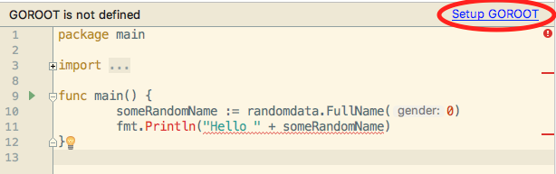

## First thing first: install Golang

Follow the instructions here:

- https://docs.google.com/document/d/1QfY-sAe2tsldDY679PBk_8pxVuMqwpX4eeP_YyjNGsY/pub (english)
- https://docs.google.com/document/d/16v3N_6xhN3OgiQNN22dNCf_RCSBIFNEH0wuUfS30bKU/pub (french)

## Download the repository in your GOPATH

Git clone the repo using this command:

```bash
$ git clone https://github.com/aubm/Golang-Codelab $GOPATH/src/github.com/aubm/golang-codelab
```

Then open the project folder with Gogland.
Opening the first Go file, you might have to specify the Go SDK that you want to use.



## Build and run your first Go program

Jump into the `demo` folder:

```bash
$ cd $GOPATH/src/github.com/aubm/golang-codelab/demo
```

This demo program prints "Hello" followed by a random name in the standard output.
Run it with this command:

```bash
$ go get ./...
$ go run main.go
Hello James Smith
```

`go get ./...` analyses all the third-party dependencies of the program and attempts to automatically download them.

`go run` compiles and runs the code in a temporary folder.
If you just want to compile without running it, use this command:

```bash
$ go build
```

This will generate a new binary file in the current directory named `demo`, or `demo.exe` on Windows.
Try and execute it with this command:

```bash
$ ./demo
Hello Anthony Moore
```

or on Windows:

```bash
$ ./demo.exe
Hello Ethan Smith
```

It should be noted that this particular file is a self-contained executable binary file.
Which means that, unlike other technologies like Java, NodeJS or PHP, you can drop it on another
compatible machine and run it, without the need for a Go runtime to be installed on that machine.

### Cross compilation

If you work on Linux and you compile a Go program using `go build`, it will generate a statically linked
binary file that can only be executed on a Linux machine that have the same architecture as the one you use.

Fortunately, Go has support for cross compilation. This means that even working on Linux, you can easily generate
an executable file for Windows or Mac, using this command:

```bash
$ env GOOS=windows GOARCH=amd64 go build
$ ls
demo.exe main.go
```

## Let's have a look at this demo program source code

```go
package main

import (
	"fmt"

	"github.com/Pallinder/go-randomdata"
)

func main() {
	someRandomName := randomdata.FullName(0)
	fmt.Println("Hello " + someRandomName)
}
```

- The code starts with the declaration of the package name. Here `main` is a special case that indicates that this
  particular package can be built in order to generate an executable file. Any other name would have made this code
  to be considered as a library.
- Then there is a list of imported dependencies. Each imported package exposes its api in an implicitly created
  variable, named after the name of the package.
- Then there is the `main` function. Like for the package name, the `main` function is special because it will automatically
  be invoked by the runtime at program bootstrap.

## Going further

- https://golang.org/doc/effective_go.html
- https://github.com/golang/go/wiki/CodeReviewComments
- https://golangweekly.com/